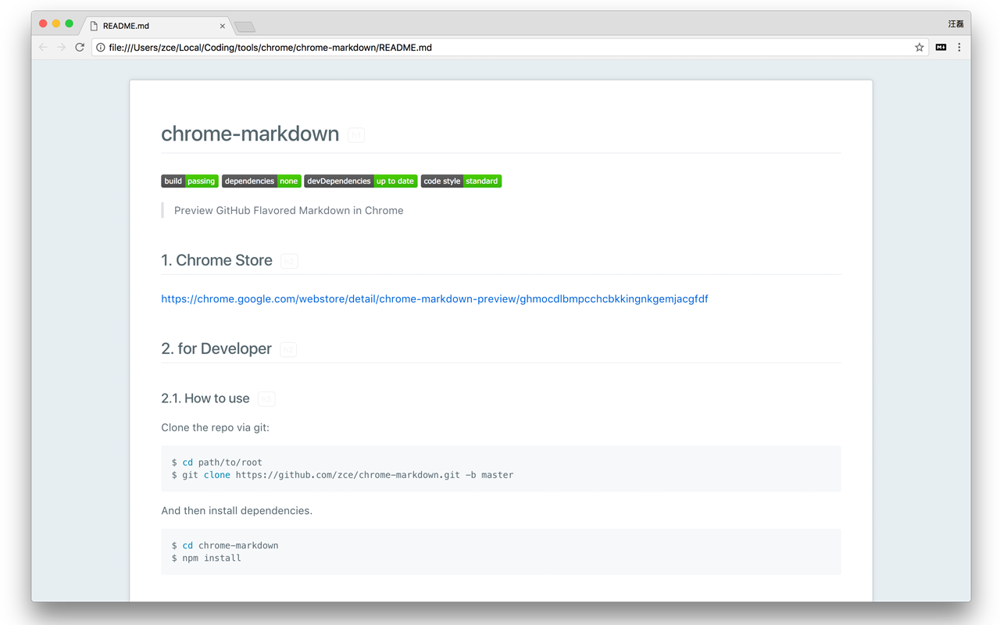

# chrome-markdown

[![Build Status][travis-image]][travis-url]
[![Dependency Status][dependency-image]][dependency-url]
[![devDependency Status][devdependency-image]][devdependency-url]
[![Code Style][style-image]][style-url]

[travis-image]: https://img.shields.io/travis/zce/chrome-markdown/master.svg
[travis-url]: https://travis-ci.org/zce/chrome-markdown
[dependency-image]: https://img.shields.io/david/zce/chrome-markdown.svg
[dependency-url]: https://david-dm.org/zce/chrome-markdown
[devdependency-image]: https://img.shields.io/david/dev/zce/chrome-markdown.svg
[devdependency-url]: https://david-dm.org/zce/chrome-markdown?type=dev
[style-image]: https://img.shields.io/badge/code%20style-standard-brightgreen.svg
[style-url]: http://standardjs.com/

> Preview GitHub Flavored Markdown in Chrome

---

## Preview




## Chrome Store

https://chrome.google.com/webstore/detail/chrome-markdown-preview/ghmocdlbmpcchcbkkingnkgemjacgfdf


## for Developer

### How to use

Clone the repo via git:

```bash
$ cd path/to/root
$ git clone https://github.com/zce/chrome-markdown.git
```

And then install dependencies.

```bash
$ cd chrome-markdown
$ npm install
```

### Build it

```bash
$ gulp build
# archive
$ gulp archive
```

*Note: requires a node version >= 4 and an npm version >= 2.*


## TODOS

- [ ] Support Table of Content
- [ ] Support YAML front matter
- [ ] Support Draw Diagrams
